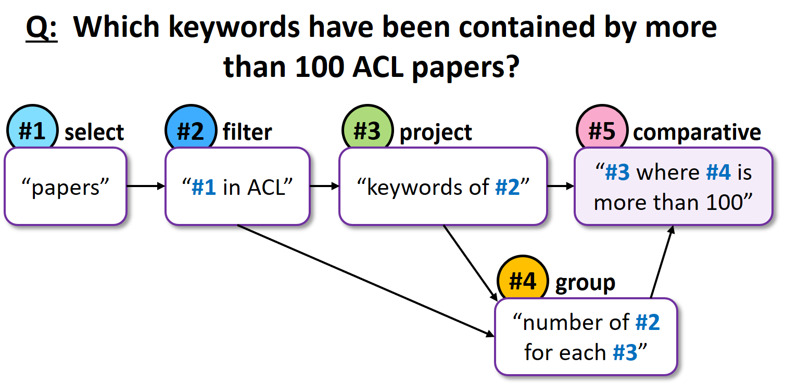
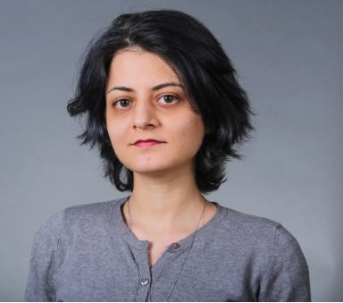

## **YUTO MMS: A Comprehensive Mobile Mapping Dataset for Enhanced SLAM Research**

YUTO MMS is a dataset for SLAM research, aim at . 
This dataset was created by a team of [AUSM Lab](https://gunhosohn.me/).


For more details on Break, please refer to our [TACL 2020 paper](#paper), and to our [blogpost](https://allenai.github.io/Break/blogpost.html).  

<center>
    <a href="https://allenai.github.io/Break/images/qdmr01.png"> 
        
      </a>
</center>


## **Paper**

[**YUTO MMS: A Comprehensive Mobile Mapping Dataset for Enhanced SLAM Research**](https://www.researchgate.net/profile/Yujia-Zhang-29)  
Yujia Zhang, SeyedMostafa Ahmadi, Jungwon Kang, Zahra Arjmandi and Gunho Sohn  
*The International Journal of Robotics Research, 2024*  

```markdown
@Article{rs15133383,
AUTHOR = {Zhang, Yujia and Kang, Jungwon and Sohn, Gunho},
TITLE = {PVL-Cartographer: Panoramic Vision-Aided LiDAR Cartographer-Based SLAM for Maverick Mobile Mapping System},
JOURNAL = {Remote Sensing},
VOLUME = {15},
YEAR = {2023},
NUMBER = {13},
ARTICLE-NUMBER = {3383},
URL = {https://www.mdpi.com/2072-4292/15/13/3383},
ISSN = {2072-4292},
DOI = {10.3390/rs15133383}
}
```

## **Authors**

<div>
<div class="card">
  
  <div class="container">
    <a href="https://yujiazhang777.github.io/yutomms.github.io/">
    <h4><b>Yujia Zhang</b></h4>  
    </a>
  </div>
    
</div>
<div class="card">
  
  <div class="container">
    <a href="https://gunhosohn.me/mostafa-ahmedi/">
    <h4><b>SeyedMostafa Ahmadi</b></h4>  
    </a>
  </div>
    
</div>
<div class="card">
  
  <div class="container">
    <a href="https://gunhosohn.me/jungwon-kang/">
    <h4><b>Jungwon Kang</b></h4>
    </a>
  </div>
    
</div>
<div class="card">
  
  <div class="container">
    <a href="https://gunhosohn.me/zahra-arjmandi/">
    <h4><b>Zahra Arjmandi</b></h4>  
    </a>
  </div>
    
</div>
<div class="card">
  
  <div class="container">
    <a href="https://gunhosohn.me/"> 
    <h4><b>Gunho Sohn</b></h4>  
    </a>
  </div> 
</div>
</div>


## **Leaderboard**

### **Submission**
Evaluating predictions for the hidden test set is done via the [AI2 Leaderboard page](https://leaderboard.allenai.org/).
Log on to the leaderboard website and follow the submission instructions.
* **[Break Leaderboard](https://leaderboard.allenai.org/break/)**
* **[Break High-Level Leaderboard](https://leaderboard.allenai.org/break_high_level/)**  

*Given the GED metric is computed by an approximation algorithm, the evaluation may take several hours. The approximation algorithm also results in slightly different GED values than the paper.*

### **Results**

**Break**

Rank | Submission | Created | EM Dev. | EM Test | SARI Dev. | SARI Test | GED Dev. | GED Test 
------------ | ------------- | ------------- | ------------- | ------------- | ------------- | ------------- | ------------- | -------------
1 | Curriculum-trained CopyNet <br>*Chris Coleman and Alex Reneau,*<br>*Northwestern University* | Jul 1, 2020 | **`_`**  | **`0.163`** | **`_`**  | **`0.757`** | **`_`**  | **`0.271`** 
2 | CopyNet <br>*([Wolfson et al., TACL 2020](https://arxiv.org/abs/2001.11770v1))* | Feb 1, 2020 | **`0.154`**  | `0.157` | **`0.748`**  | `0.746` | **`0.318`**  | `0.322` 
3 | RuleBased <br>*([Wolfson et al., TACL 2020](https://arxiv.org/abs/2001.11770v1))* | Feb 1, 2020 | `0.002`  | `0.003` | `0.508`  | `0.506` | `0.799`  | `0.802`  


**Break High-level**

Rank | Submission | Created | EM Dev. | EM Test | SARI Dev. | SARI Test | GED Dev. | GED Test 
------------ | ------------- | ------------- | ------------- | ------------- | ------------- | ------------- | ------------- | -------------
1 | CopyNet <br>*([Wolfson et al., TACL 2020](https://arxiv.org/abs/2001.11770v1))* | Feb 1, 2020 | **`0.081`**  | **`0.083`** | **`0.722`**  | **`0.722`** | **`0.319`**  | **`0.316`** 
2 | RuleBased <br>*([Wolfson et al., TACL 2020](hhttps://arxiv.org/abs/2001.11770v1))* | Feb 1, 2020 | `0.010`  | `0.012` | `0.554`  | `0.554` | `0.659`  | `0.652`  

## **Explore**

To view (many) more question decomposition examples, [explore Break](/explore.md).

## **Download**

- For the full documentation of the dataset and its format please refer to our [Github repository](https://github.com/allenai/Break).  
- Click here to [download Break](https://github.com/allenai/Break/raw/master/break_dataset/Break-dataset.zip).

